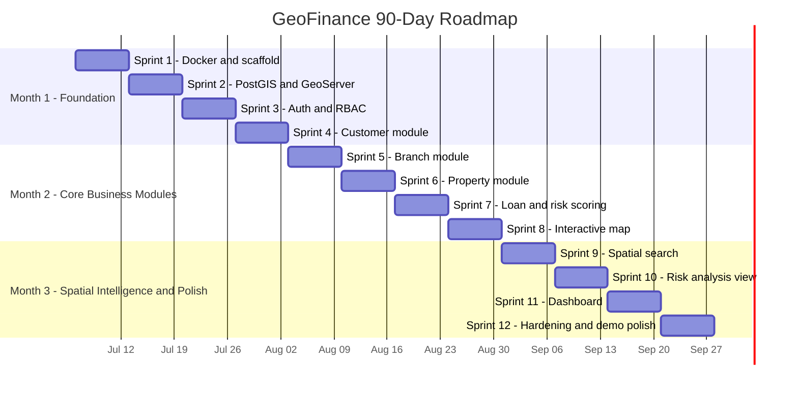

# ROADMAP.md — GeoFinance 90-Day Delivery Roadmap

**Product:** GeoFinance — Enterprise Financial Geospatial Intelligence Platform
**Owner:** Solution Delivery (1 Software Engineer, AI-assisted: GitHub Copilot / Claude Code)
**Depends on:** `README.md`, `01_PRD.md`, `02_SRS.md`, `03_DATABASE.md`, `04_AGENTS.md`, `BACKLOG.md`
**Status:** Active execution plan — the primary day-to-day guide for building GeoFinance

---

## 1. Executive Summary

This roadmap sequences 90 days of solo, AI-assisted development into 12
weekly sprints, ending in a demo-ready MVP: a recruiter or interviewer
can clone the repo, run `docker compose up`, log in, and walk through
every core module — Dashboard, Interactive Map, Customer, Branch,
Property, Loan, Spatial Search, and Risk Analysis — backed by real
Clean Architecture, a PostGIS-powered spatial layer, and RBAC-secured
APIs.

The plan does not redesign anything already decided in `01_PRD.md`,
`02_SRS.md`, or `03_DATABASE.md` — it sequences their implementation.
Every sprint ends with a tagged release and a working feature; there
are no half-finished modules at any checkpoint.

---

## 2. Product Vision (restated for delivery)

> A single platform where financial risk and geography are visible
> together — proven, in 90 days, as a working, interview-ready
> product, not a slideshow.

---

## 3. Development Strategy

| Principle | What it means in practice |
| --- | --- |
| Build first, learn while building | No dedicated "learning week" — new tech is introduced exactly when a sprint needs it (see §7 Technical Roadmap) |
| Documentation-driven | `01_PRD.md`–`04_AGENTS.md` are read before any sprint starts; this roadmap and `BACKLOG.md` are updated, never left stale |
| Enterprise architecture from day one | Clean Architecture/Repository Pattern applied starting Sprint 1 — not retrofitted later |
| AI-assisted development | Copilot/Claude Code used for boilerplate (CRUD, DTOs, migrations); the engineer owns architecture decisions and reviews every generated diff against `04_AGENTS.md` |
| One working feature per sprint | Definition of Done (§6) requires a demoable feature, not just merged code |
| Quality over quantity | MVP scope (§4) is deliberately narrower than the full `BACKLOG.md` — depth on 8 modules beats breadth on 15 |

---

## 4. MVP Scope

### 4.1 Included in the 90-day MVP

- [x] Dockerized local environment (Postgres+PostGIS, GeoServer, backend, frontend) — one command to run
- [x] Authentication (JWT) + RBAC (admin/analyst/viewer)
- [x] Customer Management (CRUD + geolocation)
- [x] Branch Management (CRUD + geolocation)
- [x] Property Management (CRUD + geolocation, linked to customer)
- [x] Loan Management (CRUD, linked to customer/property/branch) + rule-based Risk Score (per `03_DATABASE.md` `loan_risk_assessments`)
- [x] Interactive GIS Map (MapLibre/OpenLayers, GeoServer WMS layers, entity markers)
- [x] Spatial Search (radius + polygon query across entities)
- [x] Risk Analysis view (risk-zone overlay, risk tier filtering)
- [x] Dashboard (aggregate metrics, charts)
- [x] Seed data pipeline (already built — `database/seed-data/`)
- [x] Professional README, architecture diagram, demo screenshots

### 4.2 Explicitly NOT in the 90-day MVP

- [ ] AI Assistant (RAG/LLM natural-language querying) — architecture documented in `02_SRS.md §7`, **implementation deferred post-v1**; not required for the demo checklist in §1
- [ ] Cloud deployment (Terraform, Kubernetes) — local Docker Compose only for v1.0
- [ ] Full CI/CD pipeline — a minimal lint/test GitHub Action is in scope; deploy automation is not
- [ ] Multi-tenant SaaS mode
- [ ] Mobile app
- [ ] Licensed/real hazard data — synthetic risk zones (already generated) are sufficient for the demo
- [ ] Reporting export (PDF) — CSV export only if time permits, not a hard requirement

This scope split is intentional: every item in §4.1 is required for the
recruiter demo walkthrough in the objective brief; every item in §4.2
is valuable but would either introduce excessive technology surface
area for one engineer in 90 days, or isn't needed to prove the
architecture works.

---

## 5. 90-Day Timeline

### Month 1 — Foundation (Weeks 1–4)

Infrastructure, data layer, auth, and the first full vertical slice
(Customer module) proving the architecture end-to-end.

### Month 2 — Core Business Modules (Weeks 5–8)

Branch, Property, Loan, and the Interactive Map — the bulk of the
business domain and the first visual GIS payoff.

### Month 3 — Spatial Intelligence & Polish (Weeks 9–12)

Spatial Search, Risk Analysis, Dashboard, then a full hardening and
demo-readiness sprint — no new features in Week 12, only polish.

---

## 6. Weekly Roadmap (12 weeks)

### Week 1 — Docker & Project Scaffold

- **Objectives:** Stand up Docker Compose (Postgres+PostGIS, backend, frontend containers); scaffold Next.js and Express apps per `02_SRS.md §2.3` folder structure
- **Deliverables:** `docker-compose.yml`; backend boots with a `/health` endpoint; frontend boots with a placeholder landing page
- **Dependencies:** None (first week)
- **Definition of Done:** `docker compose up` starts all containers; `curl localhost:PORT/health` returns 200; committed with Clean Architecture folder skeleton from `02_SRS.md §2.3`

### Week 2 — PostGIS, GeoServer, Seed Data

- **Objectives:** Enable PostGIS extension; stand up GeoServer container; connect GeoServer to Postgres; run migrations from `03_DATABASE.md`; load seed data
- **Deliverables:** All 8 tables from `03_DATABASE.md §2` created via migration; seed data loaded (updated to UUID PKs per `03_DATABASE.md §1` note); one GeoServer WMS layer serving `branches`
- **Dependencies:** Week 1 Docker environment
- **Definition of Done:** `SELECT postgis_version();` succeeds; GeoServer admin UI reachable; seed row counts match `database/seed-data/README.md`

### Week 3 — Authentication & RBAC

- **Objectives:** Implement JWT auth flow (`02_SRS.md §6.2`); `users`/`roles` tables; login UI
- **Deliverables:** `POST /api/v1/auth/login`, `/auth/refresh`; RBAC middleware enforcing admin/analyst/viewer; frontend login page + protected route wrapper
- **Dependencies:** Week 2 schema
- **Definition of Done:** Login returns valid JWT; protected endpoint rejects missing/invalid token with RFC 7807 error; role-gated route tested for all 3 roles

### Week 4 — Customer Module (first full vertical slice)

- **Objectives:** Full CRUD for Customer entity through every architecture layer (domain → repository → service → controller → frontend)
- **Deliverables:** `/api/v1/customers` CRUD; Customer list/detail/create/edit UI
- **Dependencies:** Week 3 auth (endpoints protected)
- **Definition of Done:** Can create/view/edit/delete a customer end-to-end through the UI; unit tests for service layer; integration test for repository; this slice becomes the template for Weeks 5–7

### Week 5 — Branch Module

- **Objectives:** Full CRUD for Branch entity, including map-pickable geometry input
- **Deliverables:** `/api/v1/branches` CRUD; Branch list/detail UI with location picker
- **Dependencies:** Week 4 pattern reused
- **Definition of Done:** Branch created via UI with a real point geometry, verified in DB as valid `GEOMETRY(Point,4326)`

### Week 6 — Property Module

- **Objectives:** Full CRUD for Property entity, linked to Customer (`owner_customer_id`)
- **Deliverables:** `/api/v1/properties` CRUD; Property UI with owner selection + geometry input
- **Dependencies:** Week 4 (Customer must exist to link)
- **Definition of Done:** Property correctly links to an existing customer; orphaned property (invalid `owner_customer_id`) rejected with validation error

### Week 7 — Loan Module & Risk Scoring

- **Objectives:** Full CRUD for Loan entity; implement rule-based risk scoring service populating `loan_risk_assessments` (`03_DATABASE.md §3.7`)
- **Deliverables:** `/api/v1/loans` CRUD; `/api/v1/loans/:id/risk-score`; risk score computed from proximity to `risk_zones` + income signal, matching the formula logic already prototyped in `generate_seed_data.py`
- **Dependencies:** Weeks 4–6 (Loan links Customer + Property + Branch)
- **Definition of Done:** Creating a loan auto-computes and persists a risk assessment; risk tier visible on loan detail page

### Week 8 — Interactive Map

- **Objectives:** Integrate MapLibre/OpenLayers on the frontend; render GeoServer WMS layers + entity markers (branches, properties) with popups
- **Deliverables:** `/map` page showing all branches and properties with risk-tier color coding
- **Dependencies:** Weeks 2 (GeoServer), 5–7 (entities with geometry to render)
- **Definition of Done:** Map loads under 2s with reference dataset; clicking a marker shows entity detail; layer toggle works for at least 2 layers

### Week 9 — Spatial Search

- **Objectives:** Implement `/api/v1/spatial/search` (US-04, `02_SRS.md §4.2`); radius and polygon query support using `ST_DWithin`/`ST_Within`
- **Deliverables:** Search UI on the map (draw radius or polygon); results list + map highlight
- **Dependencies:** Week 8 map component
- **Definition of Done:** Query against reference dataset returns correct results verified manually against a known fixture; GiST index confirmed via `EXPLAIN ANALYZE` per `03_DATABASE.md §4`

### Week 10 — Risk Analysis View

- **Objectives:** Dedicated Risk Analysis page: risk-zone polygon overlay, loan risk tier filter, portfolio risk summary
- **Deliverables:** `/risk-analysis` page; filter by risk tier + region; risk zone layer toggle
- **Dependencies:** Weeks 7 (loan risk data), 8 (map)
- **Definition of Done:** Filtering by "high" risk tier correctly narrows both the map and a summary count; matches US-02 acceptance criteria in `01_PRD.md §6.1`

### Week 11 — Dashboard

- **Objectives:** Aggregate metrics dashboard (loans by tier, branch performance, customer growth) with charts
- **Deliverables:** `/dashboard` page as the default post-login screen; metric cards + at least 2 chart types
- **Dependencies:** All prior modules (dashboard aggregates their data)
- **Definition of Done:** Dashboard loads under 2s with reference dataset; numbers reconcile against a manual DB count spot-check

### Week 12 — Hardening & Demo Polish

- **Objectives:** No new features. Bug fixes, loading states, error boundaries, README finalization, architecture diagram, demo screenshots, final Docker Compose validation on a clean machine
- **Deliverables:** Updated `README.md` with setup instructions + screenshots; `architecture/` diagram exported; tagged `v1.0` release
- **Dependencies:** Weeks 1–11 complete
- **Definition of Done:** A person who has never seen the project can clone, run `docker compose up`, log in, and complete the full demo checklist in §1 without asking a question

---

## 7. Sprint Roadmap (12 sprints)

Each sprint = 1 week (§6). This section adds task-level detail,
acceptance criteria, and the git milestone for each.

| Sprint | Goal | Key tasks | Expected output | Acceptance criteria | Git milestone |
| --- | --- | --- | --- | --- | --- |
| 1 | Environment parity | Write `docker-compose.yml`; scaffold backend (Clean Architecture folders) and frontend (Next.js) | Running containers, health check | `docker compose up` succeeds cold | Tag `v0.1.0-setup` |
| 2 | Spatial data layer | Migrations for all 8 tables; PostGIS + GeoServer wiring; seed import (UUID update) | Populated DB, one WMS layer | Seed row counts match spec | Tag `v0.1.1-data` |
| 3 | Identity & access | JWT issuance/refresh; RBAC middleware; login page | Working login, protected routes | 3 roles tested against 1 protected endpoint each | Tag `v0.2.0-auth` |
| 4 | Customer vertical slice | Domain/repo/service/controller/UI for Customer | Full CRUD demoable | End-to-end create→edit→delete works via UI | Tag `v0.3.0-customer` |
| 5 | Branch vertical slice | Same pattern as Sprint 4 for Branch | Full CRUD + geometry picker | Branch geometry verified in DB | Tag `v0.4.0-branch` |
| 6 | Property vertical slice | Same pattern, with Customer FK | Full CRUD + owner link | Orphan property rejected | Tag `v0.5.0-property` |
| 7 | Loan + risk engine | Loan CRUD; risk scoring service; `loan_risk_assessments` writes | Loan with computed risk tier | Risk score auto-populates on loan create | Tag `v0.6.0-loan-risk` |
| 8 | Interactive map | Map component; WMS + marker layers; popups | `/map` page functional | Marker click shows correct entity data | Tag `v0.7.0-map` |
| 9 | Spatial search | `/spatial/search` endpoint + draw-search UI | Working radius/polygon search | Verified against known fixture | Tag `v0.8.0-spatial-search` |
| 10 | Risk analysis view | Risk zone overlay; tier filter; portfolio summary | `/risk-analysis` page | Filter narrows map + summary correctly | Tag `v0.85.0-risk-analysis` |
| 11 | Dashboard | Metrics aggregation; charts | `/dashboard` page | Numbers reconcile against DB spot-check | Tag `v0.9.0-dashboard` |
| 12 | Hardening & demo | Bug fixes; docs; screenshots; clean-machine test | Demo-ready `v1.0` | Fresh clone → full demo checklist passes | Tag `v1.0.0-demo-ready` |

---

## 8. Feature Release Plan

| Version | Feature | Sprint |
| --- | --- | --- |
| v0.1 | Project Setup (Docker, scaffolds) | 1 |
| v0.1.1 | Data layer (PostGIS, GeoServer, seed) | 2 |
| v0.2 | Authentication (JWT + RBAC) | 3 |
| v0.3 | Customer Module | 4 |
| v0.4 | Branch Module | 5 |
| v0.5 | Property Module | 6 |
| v0.6 | Loan Module (+ risk scoring) | 7 |
| v0.7 | Interactive Map | 8 |
| v0.8 | Spatial Search | 9 |
| v0.85 | Risk Analysis View | 10 |
| v0.9 | Dashboard | 11 |
| v1.0 | Production Demo (hardened, documented) | 12 |

Each version is a real git tag with release notes — not just a
milestone label — so the repository's tag history alone tells the
story of the build for anyone reviewing it.

---

## 9. Technical Roadmap

Introduce exactly one new significant technology per sprint — never
stack multiple unfamiliar tools in the same week.

| Week | New technology introduced | Why now |
| --- | --- | --- |
| 1 | Docker, Docker Compose | Everything else runs inside it |
| 2 | PostGIS, GeoServer | Spatial foundation must exist before any entity work |
| 3 | JWT, RBAC middleware | Every subsequent endpoint needs auth in place first |
| 4 | Repository Pattern / Service Layer in practice (first real slice) | Establishes the template reused through Sprint 7 |
| 5 | Geometry input UI (map click-to-set-point) | First frontend-side spatial interaction |
| 6 | Foreign-key relational integrity patterns (Customer→Property) | First cross-entity relationship |
| 7 | Risk scoring algorithm (rule-based, `jsonb` explainability field) | Domain-specific logic, isolated to one sprint |
| 8 | MapLibre/OpenLayers, WMS layer consumption | Visual GIS payoff, now that entities+geometry exist |
| 9 | PostGIS spatial predicates (`ST_DWithin`, `ST_Within`) at the query layer | Builds directly on Week 8's map |
| 10 | Layered map overlays (risk zones + filters) | Extends Week 8–9 map work, no new stack |
| 11 | Charting library (e.g. Recharts) | Isolated to dashboard, no spatial complexity |
| 12 | None (hardening only) | Protects demo stability — no new tech in the final week |

Deferred beyond Day 90 (see §4.2): GitHub Actions full CI/CD, Terraform, Kubernetes, RAG/Vector DB for the AI Assistant.

---

## 10. Documentation Roadmap

| Document | Update trigger |
| --- | --- |
| `README.md` | Every sprint — setup instructions must always match current `docker-compose.yml` reality; final polish pass in Week 12 |
| `01_PRD.md` | Only if a user story's scope materially changes — otherwise stable |
| `02_SRS.md` | Any new endpoint or architecture decision — update the same PR as the code |
| `03_DATABASE.md` | Any migration — update ER diagram + table section in the same PR (per `03_DATABASE.md §6` migration rule) |
| `04_AGENTS.md` | Any new coding convention or recipe discovered during a sprint |
| `BACKLOG.md` | Weekly — check off completed items, keep it as the live source of Sprint 0's original 11-sprint plan reconciled against this roadmap's 12-sprint execution plan |
| `ROADMAP.md` (this file) | Weekly retro — mark completed weeks, adjust only the *timeline*, never the architecture, without re-reading `02_SRS.md` first |
| `architecture/` diagrams | Week 8 (map architecture) and Week 12 (final polish) |

---

## 11. GitHub Milestones

| Milestone | Target |
| --- | --- |
| Commit volume | 100+ commits across 90 days (roughly 8–10/week — small, atomic commits per task, not one commit per sprint) |
| Branching | One branch per sprint task (`feature/customer-crud`, `feature/spatial-search`), PR into `main`, even solo — preserves reviewable history |
| README | Professional, with setup steps, screenshots, architecture diagram link, tech stack badges |
| Architecture diagram | Exported image/Mermaid render committed under `architecture/`, linked from README |
| Demo screenshots | At minimum: login, dashboard, map, one CRUD module, spatial search, risk analysis — captured in Week 12 |
| Docker deployment | `docker-compose.yml` is the single, tested source of truth for running the whole stack locally |
| Releases | 12 tagged releases (§8) each with brief release notes |
| Project board | GitHub Projects board reflecting `BACKLOG.md`, columns updated weekly |

---

## 12. Success Criteria (Day 90 exit check)

- [ ] `git clone` + `docker compose up` runs the entire stack with no manual steps beyond `.env` setup
- [ ] Login works with a seeded demo user for each of the 3 roles
- [ ] Dashboard, Interactive Map, Customer/Branch/Property/Loan modules, Spatial Search, and Risk Analysis are all reachable and functional from the UI
- [ ] Every core entity CRUD works end-to-end with no console errors
- [ ] Spatial queries return correct results and use spatial indexes (`03_DATABASE.md §4`)
- [ ] RBAC is enforced server-side, not just hidden in the UI (`02_SRS.md §5`)
- [ ] Repository has 100+ commits, a professional README, an architecture diagram, and demo screenshots
- [ ] A recruiter or interviewer unfamiliar with the project can complete the full demo checklist (§1) unassisted
- [ ] `01_PRD.md`–`04_AGENTS.md`, `BACKLOG.md`, and this `ROADMAP.md` all accurately reflect the shipped state of the repository — no stale documentation

---

*This roadmap is the primary day-to-day execution guide for GeoFinance.
Update it weekly; do not let it drift from what is actually built.*
