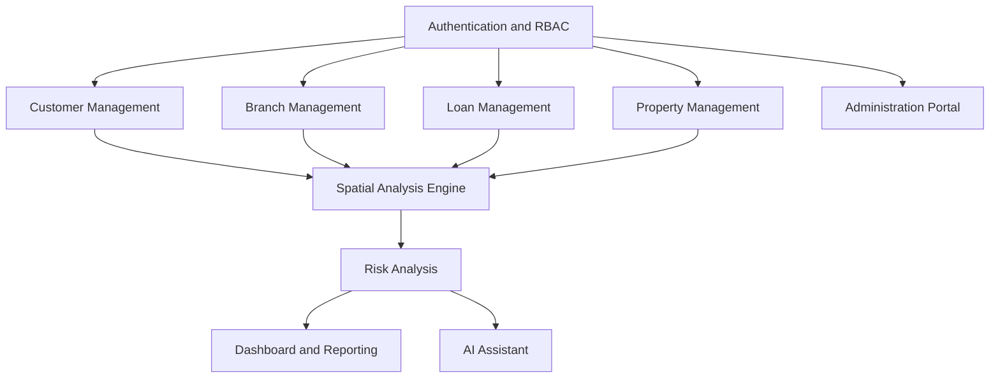
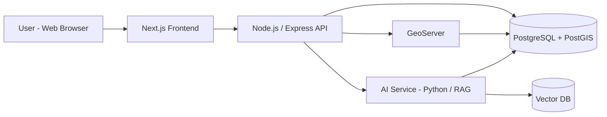

# 01_PRD.md — Product Requirement Document

**Product:** GeoFinance
**Tagline:** Enterprise Financial Geospatial Intelligence Platform
**Document owner:** Product / Solution Architecture
**Status:** Draft v1.0
**Related documents:** `02_SRS.md` (to follow), `03_DATABASE.md` (to follow), `04_AGENTS.md` (to follow)

---

## 1. Executive Summary

GeoFinance is an enterprise-grade platform that fuses core financial
services data (customers, branches, loans, properties) with geospatial
intelligence (location, proximity, hazard exposure) and AI-assisted
decisioning, into a single modular product.

Financial institutions today treat spatial context as an afterthought:
risk officers cross-reference GIS tools and spreadsheets manually to
answer questions that are inherently geographic — "how exposed is this
loan book to flood risk?", "where should we open the next branch?",
"which customers cluster near an underperforming branch?". GeoFinance
answers these questions natively, inside one system of record, with a
map-first UI and an AI assistant layered on top.

This document defines *what* GeoFinance must do and *why*, at a level
of detail sufficient for an engineering team — human or AI-assisted
(GitHub Copilot, Claude Code, Cursor) — to derive architecture,
database design, and implementation without further clarification of
product intent. Technical *how* (schemas, API contracts, coding
standards) is deferred to `02_SRS.md`, `03_DATABASE.md`, and
`04_AGENTS.md`.

---

## 2. Problem Statement

| Dimension | Current state | Consequence |
| --- | --- | --- |
| Data locality | Financial/customer data lives in core banking systems; spatial data lives in separate GIS tools | No single query answers "risk x location" |
| Decision speed | Risk/branch/underwriting decisions require manual cross-referencing across tools | Slow, error-prone, not reproducible |
| Risk visibility | Hazard exposure (flood, landslide) is assessed as a compliance checkbox, not a continuous signal | Risk concentration goes unnoticed until a loss event |
| AI adoption | Financial AI assistants answer over tabular/text data only | Spatial questions ("loans within 5km of X") are unanswerable by existing assistants |

**Problem statement (single sentence):** Financial institutions lack a
unified system that lets them see, query, and act on the intersection
of financial risk and geography in real time.

---

## 3. Product Vision & Goals

### 3.1 Vision

A single enterprise platform where every financial entity (customer,
branch, loan, property) is a first-class spatial object, queryable and
visualizable on a map, with AI-assisted risk reasoning layered on top.

### 3.2 Product goals

| Goal | Success signal |
| --- | --- |
| G1 — Unify financial and spatial data | All core entities carry validated geometry; spatial joins execute in <500ms at target scale |
| G2 — Make risk visible and explorable | Risk scores are computed from spatial proximity to hazard layers, not static tables |
| G3 — Reduce decision time | Common risk/branch-planning queries answered in one interface instead of cross-tool workflows |
| G4 — AI-assisted decisioning | AI Assistant answers natural-language spatial-financial questions grounded in platform data |
| G5 — Enterprise-grade engineering | Architecture, docs, and codebase pass the bar of a reviewable, hireable-quality portfolio/product |

### 3.3 Non-goals (explicitly out of scope for v1)

- Real-time core banking transaction processing (GeoFinance is a decision-support layer, not a system of record for transactions)
- Payment processing / money movement
- Mobile native apps (web-responsive only in v1)
- Multi-tenant SaaS billing (single-tenant/enterprise deployment assumed for v1)

---

## 4. Target Users & Personas

| Persona | Role | Primary needs |
| --- | --- | --- |
| Loan Officer / Risk Analyst | Front-line credit decisioning | Visual loan risk by location; hazard-adjusted risk scores |
| Insurance Underwriter | Risk pricing | Spatial clustering of claims/exposure by region |
| Branch / Business Planner | Network strategy | Location intelligence for new branch siting |
| Customer Analyst | CRM/growth | Geospatial view of customer concentration and growth |
| Platform Administrator | IT/Ops | RBAC-controlled management of all core entities |
| Executive / Decision Maker | Strategic oversight | Dashboard-level portfolio risk and performance view |

---

## 5. Core Business Modules

| Module | Purpose |
| --- | --- |
| Authentication & RBAC | Identity, roles, permission enforcement across all modules |
| Customer Management | CRUD + geolocation for customer records |
| Branch Management | CRUD + geolocation for branch network |
| Loan Management | Loan lifecycle, linked to customer, property, branch |
| Property Management | Property records with geometry and valuation |
| Spatial Analysis Engine | Proximity search, radius/polygon queries, hazard-zone intersection |
| Risk Analysis | Computes risk scores from spatial + financial signals |
| Dashboard & Reporting | Aggregate metrics, exportable reports |
| AI Assistant | Natural-language querying over platform + spatial data (RAG) |
| Administration Portal | User, role, and system configuration management |

---

## 6. User Stories & Acceptance Criteria

### 6.1 Loan Risk Assessment

**US-01** — As a Loan Officer, I want to see a loan's risk score
adjusted for its property's proximity to hazard zones, so that I can
make an informed approval decision.

*Acceptance criteria:*
- Given a loan with an associated property with valid geometry, the system computes a `risk_score` (0–100) and `risk_tier` (low/medium/high)
- The score factors in: distance to nearest hazard zone, hazard severity, and at least one financial signal (e.g., income-to-loan ratio)
- The risk score is visible on the loan detail view and on the map as a marker color
- If the property has no valid geometry, the system flags the loan as "risk score unavailable" rather than silently defaulting to 0

**US-02** — As a Risk Analyst, I want to filter the loan portfolio by
risk tier and geographic region, so that I can identify concentration
risk.

*Acceptance criteria:*
- Filter UI supports risk tier (multi-select) and a map-drawn polygon or radius
- Result set updates the map and a summary count within 2 seconds for the reference dataset size (see `03_DATABASE.md` for volume assumptions)

### 6.2 Branch Location Intelligence

**US-03** — As a Branch Planner, I want to visualize customer density
relative to existing branches, so that I can identify underserved
areas for new branch placement.

*Acceptance criteria:*
- Map view renders a customer density heatmap or cluster layer
- Existing branches are shown with a configurable service-radius overlay
- Planner can toggle competitor/demographic overlay layers where data is available

### 6.3 Spatial Search

**US-04** — As any authenticated user with appropriate role, I want to
search "show me all [entity] within [radius] of [point/branch]", so
that I can answer ad-hoc spatial questions without writing SQL.

*Acceptance criteria:*
- Search supports entity type selection (customers, properties, loans, branches)
- Search supports radius (km) or drawn-polygon input
- Results return as both a list (paginated) and map markers
- Query and results are exportable (CSV/GeoJSON)

### 6.4 AI Assistant

**US-05** — As a Risk Analyst, I want to ask the AI Assistant
natural-language questions like "how many high-risk loans are within
5km of Branch X", so that I get an answer without manually running a
spatial query.

*Acceptance criteria:*
- Assistant correctly parses entity type, spatial constraint, and filter from the question for a defined set of supported question templates (enumerated in `02_SRS.md`)
- Assistant response cites the underlying data (counts, entity IDs) — no unverified/hallucinated figures
- Assistant clearly states when a question falls outside supported capability rather than guessing

### 6.5 Administration

**US-06** — As a Platform Administrator, I want to assign roles (admin,
analyst, viewer) to users, so that access to sensitive financial/spatial
data is controlled.

*Acceptance criteria:*
- Roles gate both UI visibility and API-level access (enforced server-side, not just hidden in UI)
- Audit log records role changes with actor, timestamp, and before/after state

---

## 7. High-Level Solution Architecture

| Layer | Responsibility |
| --- | --- |
| Frontend (Next.js/React) | Map UI, dashboards, forms, RBAC-aware navigation |
| API (Node.js/Express) | Business logic, auth, orchestration, REST endpoints |
| PostgreSQL/PostGIS | System of record for business + spatial data |
| GeoServer | WMS/WFS layer serving for map rendering, standards-compliant spatial services |
| AI Service (Python) | RAG pipeline over platform data + documents, powers AI Assistant |
| Vector DB | Embedding store for RAG retrieval |

Full technical architecture, API contracts, and non-functional
requirements are specified in `02_SRS.md`.

---

## 8. Assumptions

1. Deployment target is single-tenant enterprise (not multi-tenant SaaS) for v1.
2. Users are pre-provisioned by an administrator; no public self-registration in v1.
3. Hazard/risk zone data may initially be synthetic or third-party-sourced pending a licensed data provider agreement.
4. Reference data volume for v1 performance targets: ~10K customers, ~5K properties, ~5K loans, ~50 branches (see `03_DATABASE.md` for scaling assumptions beyond this).
5. English is the primary UI language for v1; localization is a future enhancement.

## 9. Risks

| Risk | Impact | Likelihood | Mitigation |
| --- | --- | --- | --- |
| Real hazard/risk datasets are unavailable or costly to license | High | Medium | Start with open government data + synthetic augmentation; document provenance clearly |
| Spatial queries at scale exceed API latency targets | Medium | Medium | Ensure PostGIS spatial indexing (GiST) from day one; load-test in Sprint 6 |
| AI Assistant produces incorrect risk claims (hallucination) | High | Medium | Constrain assistant to templated, data-grounded queries; always cite source records |
| RBAC misconfiguration exposes sensitive customer/loan data | High | Low | Server-side enforcement + audit logging (see US-06); security review before any production deployment |
| Scope creep across 5 domains (fintech/GIS/AI/cloud/security) | Medium | High | Sprint-gated roadmap (see project Backlog); v1 explicitly excludes non-goals in §3.3 |

## 10. Future Enhancements (post-v1)

- Multi-tenant SaaS mode with per-tenant data isolation
- Mobile app (iOS/Android)
- Real-time hazard data feeds (live flood/weather integration)
- Automated underwriting recommendation engine (beyond assistant Q&A)
- Localization (Bahasa Malaysia, Chinese, Tamil UI)
- Terraform/Kubernetes production-grade multi-region deployment
- Marketplace of pluggable risk-scoring models

---

## 11. Document Sign-off Checklist

- [ ] Vision and goals reviewed and agreed
- [ ] User stories cover all modules listed in §5
- [ ] Assumptions validated against actual data availability
- [ ] Risks reviewed with engineering lead
- [ ] Ready to proceed to `02_SRS.md`

---

*End of 01_PRD.md. Do not generate `02_SRS.md` until this document is
reviewed and confirmed.*
