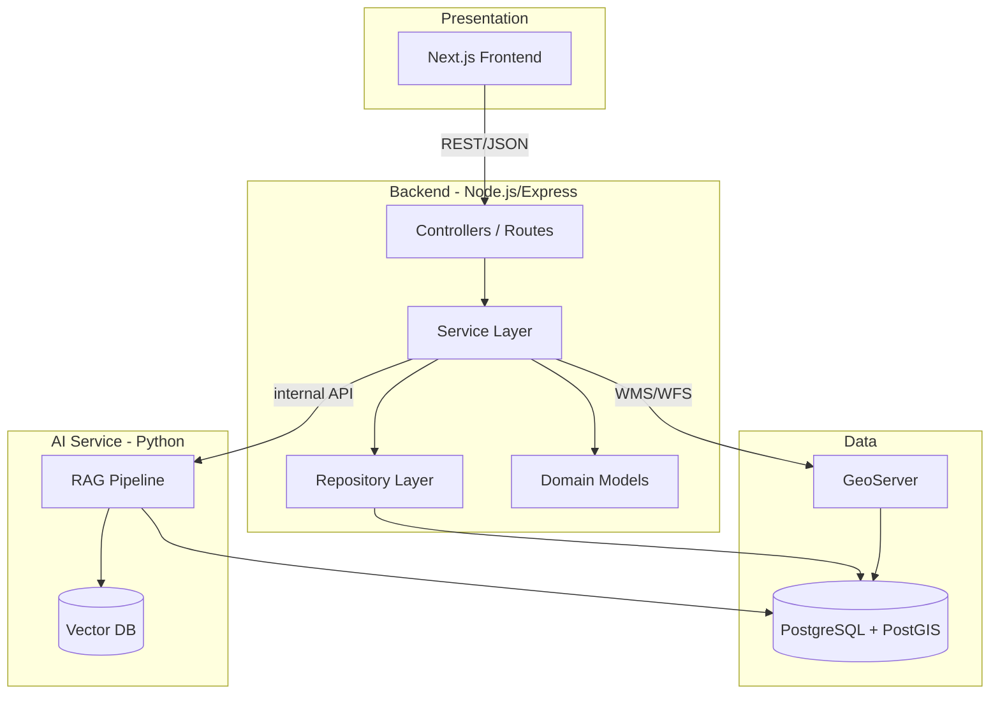
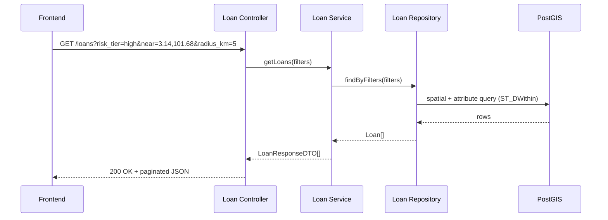
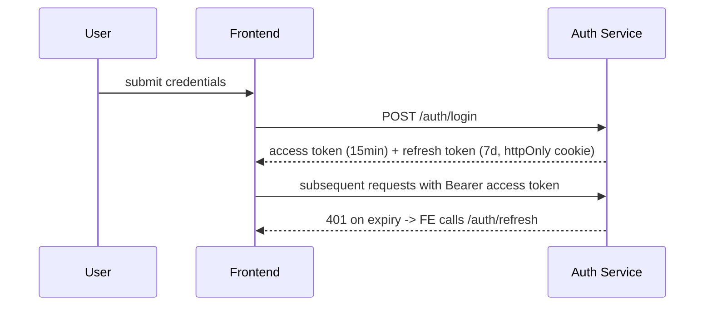

# 02_SRS.md — Software Requirement Specification

**Product:** GeoFinance
**Document owner:** Solution Architecture
**Status:** Draft v1.0
**Depends on:** `01_PRD.md`
**Related documents:** `03_DATABASE.md` (to follow), `04_AGENTS.md` (to follow)

---

## 1. Executive Summary

This SRS translates the product intent defined in `01_PRD.md` into
concrete software requirements: system architecture, API design,
non-functional requirements, security model, and technology
conventions. It is written to be directly consumable by an AI coding
assistant (GitHub Copilot, Claude Code, Cursor) or a human engineering
team to derive an implementation plan without further clarification of
*what* to build. Database schema detail is deferred to
`03_DATABASE.md`; AI-agent-specific coding conventions are formalized
in `04_AGENTS.md`.

Every functional requirement below traces back to a user story in
`01_PRD.md §6` via its ID prefix (e.g. `FR-US01-*` implements `US-01`).

---

## 2. System Architecture

### 2.1 Architecture style

GeoFinance follows **Clean Architecture** with a **Repository Pattern**
and explicit **Service Layer**, applying **Domain-Driven Design (DDD)**
tactically (aggregates, value objects) where the domain complexity
warrants it — chiefly in Loan and Risk Analysis.



### 2.2 Layer responsibilities

| Layer | Responsibility | Must NOT contain |
| --- | --- | --- |
| Controller/Route | HTTP request/response mapping, input validation trigger, calls Service | Business logic, direct DB access |
| Service | Business logic, orchestration, transaction boundaries | HTTP concerns, raw SQL |
| Repository | Data access abstraction, query construction | Business rules |
| Domain model | Entities, value objects, invariants | Framework/infrastructure code |
| DTO | Shape of data crossing layer boundaries (request/response) | Business logic |

### 2.3 Monorepo structure

```
geofinance/
├── frontend/                # Next.js app
├── backend/
│   ├── src/
│   │   ├── domain/          # Entities, value objects
│   │   ├── application/     # Services, use cases, DTOs
│   │   ├── infrastructure/  # Repositories, DB clients, GeoServer client
│   │   ├── interfaces/      # Controllers, routes, middleware
│   │   └── shared/          # Errors, utils, config
│   └── tests/
├── ai-service/               # Python RAG service
├── database/                 # Migrations, seed data
├── geoserver/                 # Workspace/layer config
├── docker/
├── docs/                     # 01_PRD.md, 02_SRS.md, 03_DATABASE.md, 04_AGENTS.md
└── architecture/             # Diagrams
```

---

## 3. Technology Stack & Conventions

| Concern | Choice | Rationale |
| --- | --- | --- |
| Frontend | Next.js, React, TypeScript, Tailwind CSS | SSR/SSG for dashboard performance, type safety |
| Backend | Node.js, Express, TypeScript | Consistent language across stack; mature ecosystem |
| Database | PostgreSQL + PostGIS | Native spatial types, GiST indexing, mature GIS support |
| GIS serving | GeoServer | Standards-compliant WMS/WFS, decouples map rendering from app DB load |
| Map rendering | MapLibre GL or OpenLayers | Open-source, no vendor lock-in |
| AI | Python, LLM API, RAG, Vector DB | Python has the strongest RAG/ML tooling |
| Auth | JWT (access + refresh tokens), RBAC | Stateless, scalable, standard for SPA/API pairing |
| Containerization | Docker, Docker Compose (local), Kubernetes (prod, later) | Environment parity, standard cloud-native path |
| IaC | Terraform (later phase) | Declarative, auditable infra |
| CI/CD | GitHub Actions | Native GitHub integration |

### 3.1 Coding standards (binding)

**Required:**
- TypeScript strict mode on frontend and backend
- UUID (v4) primary keys for all entities — never auto-increment integers, to avoid enumeration and to support future distributed/multi-region IDs
- Repository Pattern for all data access
- Service Layer for all business logic
- DTOs at every layer boundary (request DTO in, response DTO out)
- Input validation at the controller boundary (e.g. `zod`/`class-validator`) before reaching the service layer
- REST API design (see §4) with consistent resource naming

**Forbidden:**
- Raw SQL inside controllers
- Business logic inside route handlers
- Hardcoded configuration values (use environment variables + a typed config module)
- Tight coupling between layers (depend on interfaces, not concrete repository/service classes, to keep the domain testable)

---

## 4. API Design

### 4.1 Conventions

- Base path: `/api/v1`
- Resource-oriented REST, plural nouns: `/customers`, `/branches`, `/loans`, `/properties`
- Standard verbs: `GET` (read), `POST` (create), `PATCH` (partial update), `DELETE` (soft delete by default — see `03_DATABASE.md` for `deleted_at` convention)
- Pagination: `?page=1&limit=20`, response includes `{ data, meta: { page, limit, total } }`
- Filtering: `?field=value`; spatial filtering: `?near=lat,lng&radius_km=5` or `?within=<GeoJSON polygon>`
- All responses: `application/json`; spatial responses may support `?format=geojson`
- Errors: RFC 7807-style problem detail — `{ type, title, status, detail, instance }`

### 4.2 Core endpoints (representative, not exhaustive)

| Method | Path | Purpose | Traces to |
| --- | --- | --- | --- |
| `POST` | `/api/v1/auth/login` | Authenticate, issue JWT pair | US-06 |
| `GET` | `/api/v1/customers` | List customers (paginated, filterable) | Customer Management |
| `POST` | `/api/v1/customers` | Create customer | Customer Management |
| `GET` | `/api/v1/branches` | List branches with geometry | Branch Management |
| `GET` | `/api/v1/loans` | List loans, filterable by `risk_tier`, spatial params | US-01, US-02 |
| `GET` | `/api/v1/loans/:id/risk-score` | Get computed risk breakdown for a loan | US-01 |
| `GET` | `/api/v1/spatial/search` | Generic spatial search across entity types | US-04 |
| `GET` | `/api/v1/risk-zones` | List hazard zone polygons (GeoJSON) | Risk Analysis |
| `POST` | `/api/v1/ai/assistant/query` | Submit natural-language question to AI Assistant | US-05 |
| `GET` | `/api/v1/admin/users` | List users and roles | US-06 |
| `PATCH` | `/api/v1/admin/users/:id/role` | Change a user's role (audit-logged) | US-06 |

### 4.3 Sequence: risk-aware loan query (US-01/US-02)



---

## 5. Non-Functional Requirements

| Category | Requirement | Target |
| --- | --- | --- |
| Performance | Spatial query response time (reference dataset, see `03_DATABASE.md`) | p95 < 500ms |
| Performance | Dashboard initial load | < 2s on broadband |
| Scalability | API stateless, horizontally scalable | Supports N replicas behind load balancer |
| Availability | Target uptime (post-cloud deployment, Sprint 9+) | 99.5% |
| Security | All endpoints authenticated except `/auth/login` | Enforced via middleware, not per-route opt-in |
| Security | RBAC enforced server-side | Every controller checks role via middleware, not UI-only |
| Security | Data in transit | TLS 1.2+ everywhere |
| Security | Sensitive data at rest | Encrypted DB volume in cloud deployment |
| Auditability | All mutating admin actions logged | Actor, timestamp, before/after state |
| Observability | Structured logging, request tracing | JSON logs, correlation ID per request |
| Data privacy | Synthetic/test data clearly distinguished from production | See seed data provenance doc |

---

## 6. Security Model

### 6.1 Roles

| Role | Access level |
| --- | --- |
| `admin` | Full access, including user/role management |
| `analyst` | Read/write on business entities and risk analysis; no admin functions |
| `viewer` | Read-only across business entities; no AI Assistant mutation actions |

### 6.2 Authentication flow



- Access tokens: short-lived JWT, `role` and `userId` claims
- Refresh tokens: httpOnly, secure cookie, rotated on use
- Passwords: hashed with bcrypt (cost factor ≥ 12)

---

## 7. AI Assistant — Functional Scope (v1)

The AI Assistant (US-05) is scoped to a **constrained, templated query
set** in v1 — not open-ended free-form reasoning — to control
hallucination risk per `01_PRD.md §9` risk register.

| Supported question pattern | Example |
| --- | --- |
| Count entities within radius of a point/branch, filtered by attribute | "High-risk loans within 5km of Branch X" |
| Compare risk tier distribution across regions | "Compare risk tiers between Shah Alam and Klang branches" |
| Summarize a single entity's risk factors | "Why is loan LN00123 high risk?" |

Out of scope for v1: open-ended financial advice, predictive
forecasting, unconstrained natural language SQL generation.

Every AI Assistant response must include the underlying record count
and/or entity IDs it used to generate the answer (data-grounding
requirement carried from `01_PRD.md US-05` acceptance criteria).

---

## 8. Assumptions Carried from PRD

Same as `01_PRD.md §8`, plus:
- The AI service communicates with the backend over an internal
  (non-public) API; it does not query PostgreSQL directly in
  production to preserve the Repository/Service boundary — exception
  permitted in local dev for iteration speed.
- GeoServer is treated as a read replica/service layer for map tiles;
  it is not the system of record.

## 9. Risks Carried Forward / Added

In addition to `01_PRD.md §9`:

| Risk | Impact | Mitigation |
| --- | --- | --- |
| Clean Architecture overhead slows early sprints | Medium | Accept lighter enforcement in Sprint 1–2 scaffolding; tighten by Sprint 4 |
| JWT refresh token rotation bugs cause forced logouts | Low | Cover with integration tests before Sprint 3 exit |
| GeoServer + PostGIS dual-source-of-truth drift | Medium | GeoServer always reads from PostGIS live, no cached copies in v1 |

## 10. Future Enhancements

Carried from `01_PRD.md §10`, plus (SRS-specific):
- GraphQL gateway as an alternative to REST for complex nested queries
- gRPC between backend and AI service for lower-latency internal calls
- Read-replica PostgreSQL for reporting/dashboard queries at scale

---

## 11. Document Sign-off Checklist

- [ ] Architecture reviewed and agreed
- [ ] API conventions approved
- [ ] NFR targets are realistic for target infrastructure
- [ ] Security model reviewed
- [ ] Ready to proceed to `03_DATABASE.md`

---

*End of 02_SRS.md. Do not generate `03_DATABASE.md` until this document
is reviewed and confirmed.*
