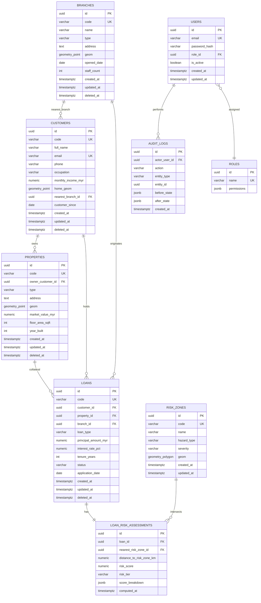

# 03_DATABASE.md — Database Design

**Product:** GeoFinance
**Document owner:** Solution Architecture
**Status:** Draft v1.0
**Depends on:** `01_PRD.md`, `02_SRS.md`
**Related documents:** `04_AGENTS.md` (to follow)

---

## 1. Executive Summary

This document defines the PostgreSQL/PostGIS schema for GeoFinance:
entity model, relationships, spatial columns, indexing strategy,
naming conventions, and migration approach. It implements the entities
introduced conceptually in `01_PRD.md §5` and the layer conventions
(UUID primary keys, Repository Pattern data access) mandated in
`02_SRS.md §3.1`.

**Note on seed/demo data:** early prototype seed data (see
`database/seed-data/`) used human-readable string codes as primary
keys (e.g. `BR001`, `CUST00001`) for quick local iteration. Per
`02_SRS.md`'s binding coding standard, the production schema below
uses **UUID v4 primary keys** on every table, with the human-readable
string retained as a separate unique `code` column for display and
backward compatibility with existing seed scripts. The seed data
importer must be updated to generate/attach UUIDs on load (tracked as
a Sprint 1 task).

---

## 2. Entity-Relationship Diagram



---

## 3. Table Definitions

### 3.1 Naming conventions (binding)

| Convention | Rule |
| --- | --- |
| Tables | `snake_case`, plural (`branches`, `loan_risk_assessments`) |
| Columns | `snake_case` |
| Primary key | `id`, type `UUID`, default `gen_random_uuid()` |
| Human-readable identifier | `code`, `VARCHAR`, unique, e.g. `BR001` |
| Foreign key | `<referenced_singular>_id`, e.g. `branch_id` |
| Geometry column | `geom` (point) or explicit `home_geom`/`geom` if a table has one primary spatial column |
| Timestamps | `created_at`, `updated_at` (both `TIMESTAMPTZ`, default `now()`) |
| Soft delete | `deleted_at TIMESTAMPTZ NULL` — application filters `WHERE deleted_at IS NULL` by default at the repository layer |
| Money | `NUMERIC(14,2)`, suffix `_myr` where currency-specific |
| Enums | `VARCHAR` + `CHECK` constraint in v1 (upgrade path: native `ENUM` type or lookup table if the value set grows) |

### 3.2 `branches`

| Column | Type | Constraints |
| --- | --- | --- |
| id | UUID | PK, default `gen_random_uuid()` |
| code | VARCHAR(10) | UNIQUE, NOT NULL |
| name | VARCHAR(120) | NOT NULL |
| type | VARCHAR(40) | CHECK IN ('main_branch','retail_branch','sme_centre','priority_banking') |
| address | TEXT | |
| geom | GEOMETRY(Point, 4326) | NOT NULL |
| opened_date | DATE | |
| staff_count | INTEGER | CHECK >= 0 |
| created_at / updated_at / deleted_at | TIMESTAMPTZ | see §3.1 |

### 3.3 `customers`

| Column | Type | Constraints |
| --- | --- | --- |
| id | UUID | PK |
| code | VARCHAR(12) | UNIQUE, NOT NULL |
| full_name | VARCHAR(120) | NOT NULL |
| email | VARCHAR(120) | UNIQUE, NOT NULL |
| phone | VARCHAR(20) | |
| occupation | VARCHAR(60) | |
| monthly_income_myr | NUMERIC(12,2) | CHECK >= 0 |
| home_geom | GEOMETRY(Point, 4326) | |
| nearest_branch_id | UUID | FK -> branches.id, NULL allowed |
| customer_since | DATE | |
| created_at / updated_at / deleted_at | TIMESTAMPTZ | |

> `ic_number_fake` (used in seed data) is intentionally **not** part of
> the production schema as a plain column — a real deployment must
> store any national ID as encrypted-at-rest or tokenized, per data
> protection requirements. Decision on exact approach deferred to a
> security addendum before production go-live.

### 3.4 `properties`

| Column | Type | Constraints |
| --- | --- | --- |
| id | UUID | PK |
| code | VARCHAR(12) | UNIQUE, NOT NULL |
| owner_customer_id | UUID | FK -> customers.id, NOT NULL |
| type | VARCHAR(40) | CHECK IN ('terrace_house','condominium','apartment','semi_detached','bungalow','shop_lot') |
| address | TEXT | |
| geom | GEOMETRY(Point, 4326) | NOT NULL |
| market_value_myr | NUMERIC(14,2) | CHECK > 0 |
| floor_area_sqft | INTEGER | CHECK > 0 |
| year_built | INTEGER | |
| created_at / updated_at / deleted_at | TIMESTAMPTZ | |

### 3.5 `loans`

| Column | Type | Constraints |
| --- | --- | --- |
| id | UUID | PK |
| code | VARCHAR(12) | UNIQUE, NOT NULL |
| customer_id | UUID | FK -> customers.id, NOT NULL |
| property_id | UUID | FK -> properties.id, NULL allowed (non-collateralized loans) |
| branch_id | UUID | FK -> branches.id, NOT NULL |
| loan_type | VARCHAR(40) | CHECK IN ('home_loan','personal_loan','sme_business_loan','auto_loan','renovation_loan') |
| principal_amount_myr | NUMERIC(14,2) | CHECK > 0 |
| interest_rate_pct | NUMERIC(5,2) | CHECK > 0 |
| tenure_years | INTEGER | CHECK > 0 |
| status | VARCHAR(20) | CHECK IN ('pending_approval','active','closed','defaulted','rejected') |
| application_date | DATE | NOT NULL |
| created_at / updated_at / deleted_at | TIMESTAMPTZ | |

### 3.6 `risk_zones`

| Column | Type | Constraints |
| --- | --- | --- |
| id | UUID | PK |
| code | VARCHAR(10) | UNIQUE, NOT NULL |
| name | VARCHAR(120) | NOT NULL |
| hazard_type | VARCHAR(30) | CHECK IN ('flood','landslide','other') |
| severity | VARCHAR(10) | CHECK IN ('low','medium','high') |
| geom | GEOMETRY(Polygon, 4326) | NOT NULL |
| created_at / updated_at | TIMESTAMPTZ | |

### 3.7 `loan_risk_assessments`

Separated from `loans` (rather than embedded columns) so risk can be
**recomputed over time** without mutating the loan record — supports
an audit trail of how risk evolved.

| Column | Type | Constraints |
| --- | --- | --- |
| id | UUID | PK |
| loan_id | UUID | FK -> loans.id, NOT NULL |
| nearest_risk_zone_id | UUID | FK -> risk_zones.id, NULL allowed |
| distance_to_risk_zone_km | NUMERIC(6,2) | |
| risk_score | NUMERIC(5,1) | CHECK BETWEEN 0 AND 100 |
| risk_tier | VARCHAR(10) | CHECK IN ('low','medium','high') |
| score_breakdown | JSONB | stores the weighted factors used, for explainability (supports US-05 "why is this loan high risk") |
| computed_at | TIMESTAMPTZ | default `now()` |

### 3.8 `users`, `roles`, `audit_logs`

Implements `02_SRS.md §6` security model.

| Table | Key columns |
| --- | --- |
| `roles` | `id UUID PK`, `name VARCHAR UNIQUE` ('admin','analyst','viewer'), `permissions JSONB` |
| `users` | `id UUID PK`, `email UNIQUE`, `password_hash`, `role_id FK`, `is_active BOOLEAN` |
| `audit_logs` | `id UUID PK`, `actor_user_id FK`, `action`, `entity_type`, `entity_id`, `before_state JSONB`, `after_state JSONB`, `created_at` |

---

## 4. Spatial Indexing Strategy

```sql
CREATE INDEX idx_branches_geom       ON branches       USING GIST (geom);
CREATE INDEX idx_customers_geom      ON customers      USING GIST (home_geom);
CREATE INDEX idx_properties_geom     ON properties     USING GIST (geom);
CREATE INDEX idx_risk_zones_geom     ON risk_zones     USING GIST (geom);
```

All spatial predicates (`ST_DWithin`, `ST_Within`, `ST_Intersects`)
must go through these GiST indexes — verified via `EXPLAIN ANALYZE` in
CI for the core spatial queries listed in `02_SRS.md §4.2` before a
migration touching these tables is merged.

Standard B-tree indexes additionally required on all foreign keys and
on `loans.status`, `loans.risk_tier` (via `loan_risk_assessments`),
and `code` columns.

---

## 5. Data Volume & Scaling Assumptions

Carried from `01_PRD.md §8`, restated for schema sizing:

| Entity | v1 reference volume | 3-year projected volume |
| --- | --- | --- |
| customers | ~10,000 | ~150,000 |
| properties | ~5,000 | ~80,000 |
| loans | ~5,000 | ~100,000 |
| branches | ~50 | ~150 |
| risk_zones | ~50 | ~500 (finer-grained hazard polygons) |

At 3-year projected volume, spatial queries remain performant under
GiST indexing per standard PostGIS benchmarks; no partitioning is
required at this scale. Partitioning `loans` by `application_date`
year is a documented future enhancement if volume materially exceeds
projection.

---

## 6. Migration Strategy

- Tool: a TypeScript-first migration tool consistent with the backend
  stack (e.g. `node-pg-migrate` or Prisma Migrate — final selection is
  an open decision, see `02_SRS.md` open items; either satisfies the
  constraints here).
- One migration file per schema change, checked into
  `database/migrations/`, never edited after merge (write a new
  migration to amend).
- `CREATE EXTENSION IF NOT EXISTS postgis;` runs in migration `0001`.
- Seed data (`database/seed-data/`) is a **separate, optional** step
  from schema migration — migrations must run cleanly against an empty
  database with zero seed data.

---

## 7. Assumptions

Carried from `01_PRD.md §8` and `02_SRS.md §8`, plus:
- `SRID 4326` (WGS84) is the standard CRS for all geometry columns; any
  layer requiring a projected CRS for area/distance calculation
  reprojects at query time (`ST_Transform`), not at storage time.
- Soft delete (`deleted_at`) is the default deletion strategy for all
  business entities to preserve loan/audit history; hard delete is
  only used for `audit_logs` retention policy enforcement (out of
  scope for v1 detail).

## 8. Risks

Carried from `02_SRS.md §9`, plus:

| Risk | Impact | Mitigation |
| --- | --- | --- |
| Seed data string IDs (`BR001`) conflict with UUID PK convention | Low | Seed importer updated to generate UUIDs, retain string as `code` (see §1 note) |
| JSONB `score_breakdown` schema drifts without versioning | Medium | Include a `schema_version` key inside the JSONB payload from day one |
| Soft-deleted rows silently included in an unfiltered repository query | Medium | Repository base class enforces `deleted_at IS NULL` by default; explicit opt-in required to include deleted rows |

## 9. Future Enhancements

Carried from `01_PRD.md §10` / `02_SRS.md §10`, plus:
- Table partitioning for `loans` and `audit_logs` at high volume
- Read-replica routing for reporting queries
- `risk_zones` versioning (effective-dated hazard layers rather than a single current snapshot)

---

## 10. Document Sign-off Checklist

- [ ] ER diagram reviewed and agreed
- [ ] Naming conventions approved
- [ ] Spatial indexing strategy validated against `02_SRS.md` performance NFRs
- [ ] Migration tool decision finalized
- [ ] Ready to proceed to `04_AGENTS.md`

---

*End of 03_DATABASE.md. Do not generate `04_AGENTS.md` until this
document is reviewed and confirmed.*
